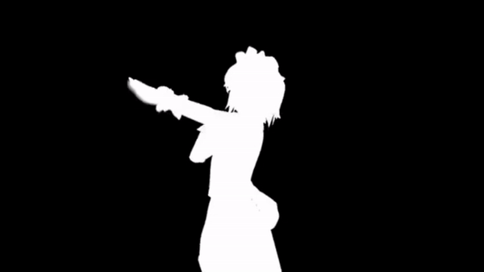
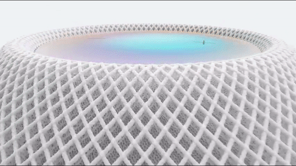
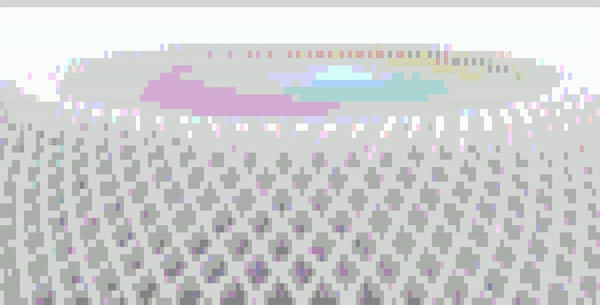

# ASCII Art
Программа, переводящая растровую картинку в изображение, составленное из ASCII-символов.

## Как работать с программой
Начать выполнение `to_ascii.py` в командной строке с необходимыми параметрами. 

Для подробной информации о запуске введи `python to_ascii.py --help`.

Пример команды: `python to_ascii.py -t 150 images/aa.png images/result.txt`

## Демо
Пример перевода изображения в монохромный ASCII-Art: 

Пример перевода изображения в ANSI-Art:

Пример перевода видео в ASCII-Art:

Пример перевода видео в ANSI-Art:

_Автор — Пахтусова Екатерина, группа КН-203_